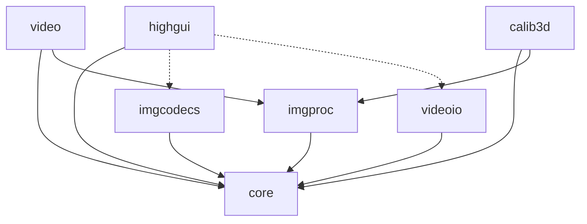

OpenCV is organized into a set of modules, each providing specific functionality for computer vision tasks. Understanding this modular structure helps you choose the right tools for your applications.

## Core Modules

<CardGroup cols={2}>
  <Card title="core" icon="cube" href="/modules/core">
    Fundamental data structures (Mat), basic operations, and utilities
  </Card>
  <Card title="imgproc" icon="image" href="/modules/imgproc">
    Image processing functions including filtering, transforms, and feature detection
  </Card>
  <Card title="imgcodecs" icon="file-image" href="/modules/imgcodecs">
    Image file reading and writing with support for multiple formats
  </Card>
  <Card title="videoio" icon="video" href="/modules/videoio">
    Video capture and writing interfaces for cameras and video files
  </Card>
  <Card title="highgui" icon="window-maximize" href="/modules/highgui">
    High-level GUI functions for window management and user interaction
  </Card>
  <Card title="video" icon="film" href="/modules/video">
    Video analysis including motion tracking and background subtraction
  </Card>
  <Card title="calib3d" icon="camera" href="/modules/calib3d">
    Camera calibration and 3D reconstruction algorithms
  </Card>
</CardGroup>

## Module Dependencies

OpenCV modules are designed with clear dependencies to maintain modularity:



<Note>
The **core** module is the foundation - all other modules depend on it for basic data structures and operations.
</Note>

## Module Descriptions

### Core Module
The backbone of OpenCV providing:
- **Mat** class for n-dimensional arrays
- Basic array operations (add, subtract, multiply)
- Mathematical functions
- XML/YAML persistence
- Utility functions and system information

### Image Processing (imgproc)
Comprehensive image processing capabilities:
- Linear and non-linear filtering
- Geometric transformations
- Color space conversions
- Histograms
- Structural analysis and shape descriptors
- Motion analysis and object tracking
- Feature detection

### Image Codecs (imgcodecs)
Image I/O operations:
- Support for JPEG, PNG, TIFF, WebP, AVIF, and more
- Image reading with `imread()`
- Image writing with `imwrite()`
- Animation support (GIF, AVIF, APNG)
- Metadata handling (EXIF, XMP, ICC)

### Video I/O (videoio)
Video capture and writing:
- **VideoCapture** class for reading from cameras or files
- **VideoWriter** class for creating video files
- Multiple backend support (FFmpeg, GStreamer, DirectShow)
- Audio stream support
- Hardware acceleration options

### High-Level GUI (highgui)
User interface utilities:
- Window creation and management
- Image display with `imshow()`
- Keyboard and mouse event handling
- Trackbars for interactive parameter adjustment
- OpenGL integration support

### Video Analysis (video)
Advanced video processing:
- Optical flow (Lucas-Kanade, Farneback)
- Object tracking (MeanShift, CamShift)
- Background subtraction (MOG2, KNN)
- Motion analysis algorithms

### Camera Calibration (calib3d)
3D vision and calibration:
- Camera calibration (intrinsic and extrinsic parameters)
- Stereo calibration and rectification
- 3D reconstruction
- Pose estimation
- Homography computation

## Choosing the Right Module

<Tabs>
  <Tab title="Image Processing">
    Use **imgproc** for:
    - Filtering and smoothing images
    - Edge detection
    - Color transformations
    - Geometric transformations (resize, rotate)
    - Contour detection
  </Tab>
  <Tab title="Video Analysis">
    Use **video** and **videoio** for:
    - Reading from cameras or video files
    - Tracking moving objects
    - Detecting motion
    - Background/foreground segmentation
    - Writing processed video
  </Tab>
  <Tab title="3D Vision">
    Use **calib3d** for:
    - Camera calibration
    - Stereo vision
    - 3D reconstruction
    - AR/VR applications
    - Depth estimation
  </Tab>
  <Tab title="I/O Operations">
    Use **imgcodecs** and **videoio** for:
    - Loading and saving images
    - Capturing from cameras
    - Recording video
    - Format conversion
  </Tab>
</Tabs>

## Getting Started

To use OpenCV modules in your code:

```cpp
#include <opencv2/core.hpp>        // Core functionality
#include <opencv2/imgproc.hpp>     // Image processing
#include <opencv2/imgcodecs.hpp>   // Image I/O
#include <opencv2/highgui.hpp>     // GUI functions
#include <opencv2/videoio.hpp>     // Video I/O
#include <opencv2/video.hpp>       // Video analysis
#include <opencv2/calib3d.hpp>     // Calibration and 3D

using namespace cv;
```

## Next Steps

<CardGroup cols={2}>
  <Card title="Explore Core Module" href="/modules/core">
    Learn about Mat and fundamental operations
  </Card>
  <Card title="Image Processing" href="/modules/imgproc">
    Discover filtering and transformation functions
  </Card>
  <Card title="Quick Start Guide" href="/quickstart">
    Build your first OpenCV application
  </Card>
  <Card title="API Reference" href="/api-reference">
    Browse the complete API documentation
  </Card>
</CardGroup>